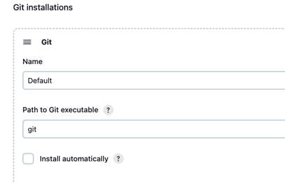
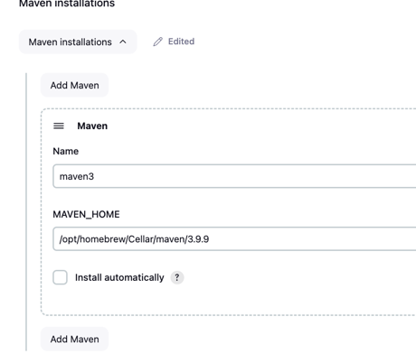
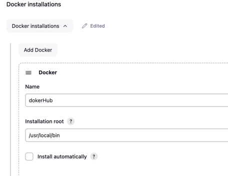
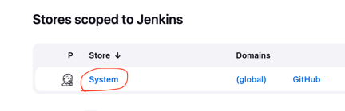
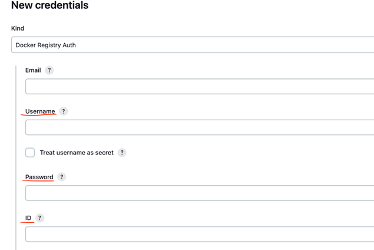
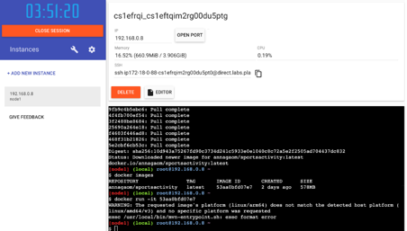
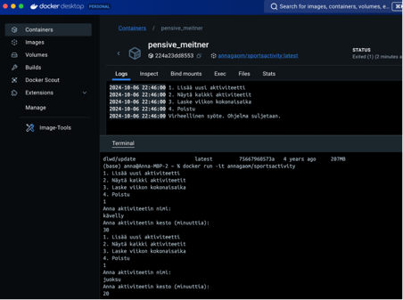

# Sports Time Tracker

## Projektin kuvaus
**Sports Time Tracker** on yksinkertainen Java-sovellus, joka mahdollistaa käyttäjien kirjata viikoittaisia urheilutoimintoja, tarkastella kirjattuja aktiviteetteja ja laskea viikon aikana liikuntaan käytetyn kokonaisajan. Sovellus käyttää komentorivikäyttöliittymää ja tallentaa urheilusuorituksia yksinkertaiseen tietorakenteeseen.

## Ominaisuudet
- Kirjaa uusi urheilutoiminto (nimi ja kesto minuutteina).
- Näyttää kaikki tallennetut urheilutoiminnot.
- Laskee viikon aikana liikuntaan käytetyn kokonaisajan.
- Helppokäyttöinen komentorivikäyttöliittymä.

## Teknologiat
- **Maven**: Rakennustyökaluna.
- **Docker**: Sovelluksen kontittamiseen.
- **Jenkins**: Jatkuvaan integrointiin ja rakentamiseen.
- **UTM (VirtuaaliBox mac:lle): Asennetaan virtuaalikone ->Asennetaan Docker virtuaalikonelle ja ajetaan Docker-kontti.**

## Projektin rakenne
```
├── Dockerfile                   # Docker-kuvan rakentamiseen**
├── README.md                    # Tämä tiedosto**
├── pom.xml                      # Mavenin konfiguraatiotiedosto**
├── src
│   ├── main
│   │   └── java
│   │       └── SportsTimeTracker.java      # Sovelluksen pääluokka
│   └── test
│       └── java
│           └── SportsActivityTest.java  # Yksikkötestit
└── target                       # Käännetyt tiedostot ja testiraportit
```
## Ohjeet
**Ohjeet, kuinka sovellus voidaan suorittaa paikallisesti, Dockerilla ja Linux-virtuaalikoneessa.**
1. **Luo uusi projekti ja lisää uusi luokka `SportsActivity` sekä `SportsActivityjaTest`.**
2. **Lisää ``Dockerfile`**
```

# Use an official Maven image as a parent image
FROM maven:latest

# Set metadata information
LABEL authors="anna"

# Set the working directory in the container
WORKDIR /app

# Copy the pom.xml file to the container
COPY pom.xml /app/

# Copy the entire project to the container
COPY . /app/

# Package your application
RUN mvn package

# Run the main class (assuming your application has a main class)
CMD ["java", "-jar", "target/sportsActivity.jar"]

```

3. **Lisää seuraavat koodit pom.xml-tiedostoon:**
pom.xml:
```
<dependencies>
        <dependency>
            <groupId>junit</groupId>
            <artifactId>junit</artifactId>
            <version>4.13.1</version>
            <scope>test</scope>
        </dependency>
        <dependency>
            <groupId>org.junit.jupiter</groupId>
            <artifactId>junit-jupiter</artifactId>
            <version>5.8.1</version>
            <scope>test</scope>
        </dependency>
    </dependencies>

    <build>
        <finalName>sportsActivity</finalName>
        <plugins>
            <!-- Compiler Plugin for setting the Java version -->
            <plugin>
                <groupId>org.apache.maven.plugins</groupId>
                <artifactId>maven-compiler-plugin</artifactId>
                <version>3.13.0</version>
                <configuration>
                    <source>17</source>
                    <target>17</target>
                </configuration>
            </plugin>

            <!-- JAR Plugin for configuring the manifest file -->
            <plugin>
                <groupId>org.apache.maven.plugins</groupId>
                <artifactId>maven-jar-plugin</artifactId>
                <version>3.4.1</version>
                <configuration>
                    <includes>
                        <include>**/*.class</include>
                    </includes>
                </configuration>
            </plugin>

            <!-- JaCoCo Plugin for code coverage -->
            <plugin>
                <groupId>org.jacoco</groupId>
                <artifactId>jacoco-maven-plugin</artifactId>
                <version>0.8.12</version>
                <executions>
                    <execution>
                        <id>jacoco-initialize</id>
                        <goals>
                            <goal>prepare-agent</goal>
                        </goals>
                    </execution>
                    <execution>
                        <id>jacoco-report</id>
                        <phase>test</phase>
                        <goals>
                            <goal>report</goal>
                        </goals>
                    </execution>
                </executions>
            </plugin>
        </plugins>
    </build>
```
4. **Suorita maven/ mvn install ja luoda target-hakemisto.**
5. **Push repository GitHub-tilillesi.**
6. **Luo uusi repository `SportsActivity` docker Hubissa.**
   **Aseta Jenkins-palvelin: Dashboard -> Manage Jenkins ->Tools**

   
   
   
   *Tallenna*
7. **Luo credential Docker Hubiin**
   *Manage Jebkins -> Credentials -> System*
   
   *Add domain, esim. dockerHub*
   *Add Credentials*
   *Kind: Docker Registry Auth*
   *Enter Username, password and ID*
   *Create*
   

8. **Luo Jenkins-pipeline:**
   *Dashboard -> New Item -> Pipeline*
   *Lisää seuraava koodi pipeline-skriptiin:*

   *Create uusi item-> lisää Definition, valitse  Pipeline script lisää koodit:*
```
   pipeline {
    agent any

    environment {
        DOCKERHUB_REPO = 'annagaom/sportsactivity'    // Docker Hub repository
        DOCKER_IMAGE_TAG = 'latest'          // Docker image tag
    }

    stages {
        stage('Checkout') {
            steps {
                git 'https://github.com/annagaom/SportsActivity.git' // Change to your Git repository
            }
        }
        stage('Build Docker Image') {
            steps {
                script {
                    // Adding Docker's path to the environment
                    withEnv(["PATH=/usr/local/bin:/usr/bin:/bin"]) {
                        docker.build("${DOCKERHUB_REPO}:${DOCKER_IMAGE_TAG}")
                    }
                }
            }
        }
        stage('Push Docker Image to Docker Hub') {
            steps {
                script {
                    withEnv(["PATH=/usr/local/bin:/usr/bin:/bin"]) { // Ensure correct PATH is used
                        withCredentials([usernamePassword(credentialsId: 'docker_credentials', // Change to your credential ID
                                                         usernameVariable: 'DOCKER_USER', 
                                                         passwordVariable: 'DOCKER_PASS')]) {
                            sh """
                                docker login -u ${DOCKER_USER} -p ${DOCKER_PASS}
                                docker build -t ${DOCKER_USER}/sportsactivity:latest .
                                docker push ${DOCKER_USER}/sportsactivity:latest
                                docker logout
                            """
                        }
                    }
                }
            }
        }
    }
}
   ```
*Build now*
*Luo Docker-image sovelluksesta ja push se Docker Hubiin.*

8. **Asentaa UTM(virtuaalibox Macille)**
1. **Luo uusi Virtual Machine**
2. **IAsenna Docker Linux-virtuaalikoneeseen**
3. **Hae Docker-image Docker Hubista.**
4. **RSuorita Docker-kontti:** 
   *Avaa seuraava linkki*  
   [Play with Docker](https://labs.play-with-docker.com/)

*Login and Start*
*Add new instance and run:*
*Pull the image you what to test*
```
docker login
docker pull annagaom/sportsactivity:latest
```



5. **Jos run image ei toimi Doker player:ssa, voit Suorita Docker-kontti Docker desktopissa:**
   


  


